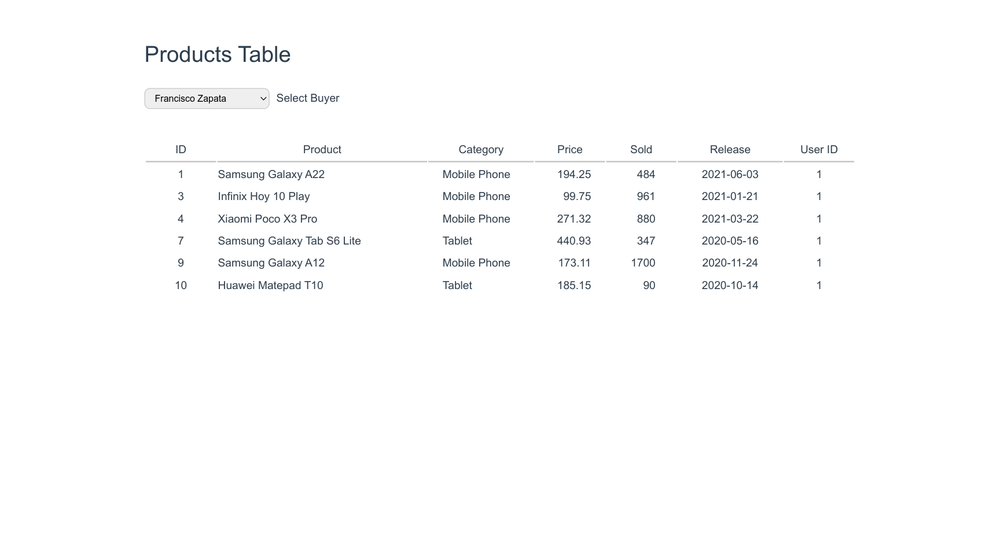

# JSON-Server App

App developed to test json-server as a local fake API provider.

[json-server](https://github.com/typicode/json-server) was developed by TypiCode and (according to their Readme) allows to "Get a complete fake REST API with zero coding in less than 30 seconds (seriously)".

## Project Setup

### Install dependencies

```sh
yarn
```

### Install json-server and run it

```sh
npm install -g json-server
json-server --watch json/data.json
```

### Run project

```sh
yarn dev
```

## DEMO


